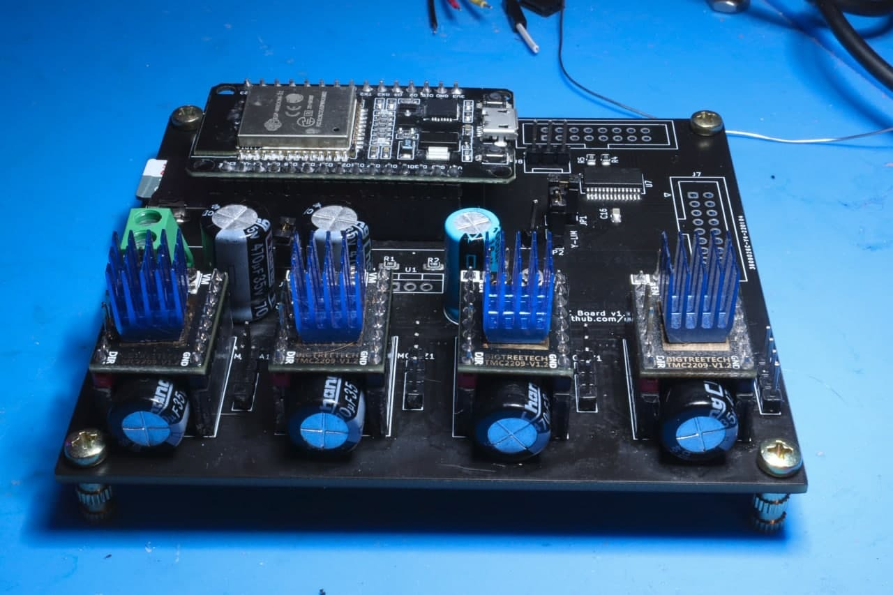

# tmccncboard

TMC2209 GRBL-ESP32 CNC Board

Made with Kicad 6.0




# FluidNC Configuration

This is the current profile I'm using for [FluidNC](https://github.com/bdring/FluidNC). Its currently WIP and should be used with care.

```yaml
board: Teske's Lab TMC CNC
name: TMCCNC
stepping:
  engine: RMT
  idle_ms: 255
  pulse_us: 2
  dir_delay_us: 1
  disable_delay_us: 0

axes:
  shared_stepper_disable_pin: gpio.27
  x:
    steps_per_mm: 1600.000
    max_rate_mm_per_min: 5000.000
    acceleration_mm_per_sec2: 100.000
    max_travel_mm: 250.000
    soft_limits: false
    homing:
      cycle: 2
      positive_direction: false
      mpos_mm: 150.000
      feed_mm_per_min: 100.000
      seek_mm_per_min: 200.000
      settle_ms: 500
      seek_scaler: 1.100
      feed_scaler: 1.100

    motor0:
      limit_neg_pin: NO_PIN
      limit_pos_pin: NO_PIN
      limit_all_pin: gpio.36
      hard_limits: false
      pulloff_mm:1.000

      tmc_2209:
        uart:
          txd_pin: gpio.17
          rxd_pin: gpio.16
        run_mode: StealthChop
        homing_mode: StallGuard
        step_pin: gpio.2
        direction_pin: gpio.4
        addr: 0
        r_sense_ohms: 0.110
        run_amps: 1.000
        hold_amps: 0.500
        microsteps: 16
  y:
    steps_per_mm: 400.000
    max_rate_mm_per_min: 5000.000
    acceleration_mm_per_sec2: 100.000
    max_travel_mm: 490.000
    soft_limits: false
    homing:
      cycle: 2
      positive_direction: true
      mpos_mm: 150.000
      feed_mm_per_min: 100.000
      seek_mm_per_min: 200.000
      settle_ms: 500
      seek_scaler: 1.100
      feed_scaler: 1.100

    motor0:
      limit_neg_pin: NO_PIN
      limit_pos_pin: NO_PIN
      limit_all_pin: gpio.39
      hard_limits: false
      pulloff_mm:1.000

      tmc_2209:
        run_mode: StealthChop
        homing_mode: StallGuard
        step_pin: gpio.12
        direction_pin: gpio.14
        addr: 1
        r_sense_ohms: 0.110
        run_amps: 1.000
        hold_amps: 0.500
        microsteps: 16

    motor1:
      limit_neg_pin: NO_PIN
      limit_pos_pin: NO_PIN
      limit_all_pin: gpio.34
      hard_limits: false
      pulloff_mm: 1.000
      tmc_2209:
        run_mode: StealthChop
        homing_mode: StallGuard
        step_pin: gpio.33
        direction_pin: gpio.32
        addr: 3
        r_sense_ohms: 0.110
        run_amps: 1.000
        hold_amps: 0.500
        microsteps: 16

  z:
    steps_per_mm: 400.000
    max_rate_mm_per_min: 5000.000
    acceleration_mm_per_sec2: 100.000
    max_travel_mm: 100.000
    soft_limits: false
    homing:
      cycle: 1
      positive_direction: true
      mpos_mm: 150.000
      feed_mm_per_min: 100.000
      seek_mm_per_min: 800.000
      settle_ms: 500
      seek_scaler: 1.100
      feed_scaler: 1.100

    motor0:
      limit_neg_pin: NO_PIN
      limit_pos_pin: NO_PIN
      limit_all_pin: gpio.35
      hard_limits: false
      pulloff_mm:1.000

      tmc_2209:
        run_mode: StealthChop
        homing_mode: StallGuard
        step_pin: gpio.26
        direction_pin: gpio.25
        addr: 2
        r_sense_ohms: 0.110
        run_amps: 1.000
        hold_amps: 0.500
        microsteps: 16


spi:
  miso_pin: gpio.19
  mosi_pin: gpio.23
  sck_pin: gpio.18

sdcard:
  cs_pin: gpio.5
  card_detect_pin: NO_PIN

probe:
  pin: NO_PIN
  check_mode_start: true

start:
  must_home: false

PWM:
  pwm_hz: 5000
  output_pin: gpio.13
  enable_pin: NO_PIN
  direction_pin: NO_PIN
  disable_with_s0: false
  s0_with_disable: true
  spinup_ms: 1000
  spindown_ms: 1000
  tool_num: 0
  speed_map: 0=0.000% 1000=100.000%

```
